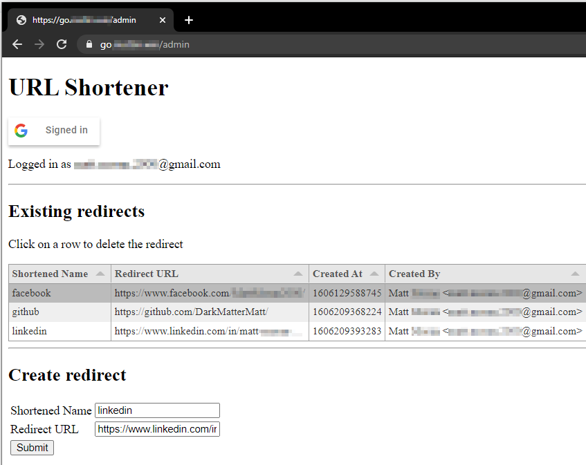

# URL Shortener

URL shortener using Cloudflare Workers & Workers KV

## ⚡ Reference

Assuming your instance is deployed to `go.example.com`

- `go.example.com/admin` is the admin portal. Add & remove redirects (shortened URLs) here
- `go.example.com/api` is the primary API endpoint (but you shouldn't need to touch this!)

## 🔋 Getting Started

### Requirements

1. [NodeJS and npm](https://www.npmjs.com/get-npm)
1. [git](https://www.atlassian.com/git/tutorials/install-git)
1. [Cloudflare Wrangler](https://developers.cloudflare.com/workers/cli-wrangler/install-update) (`npm install @cloudflare/wrangler --global`)

### Create Google Sign-In authorization credentials

1. Go to the [Credentials page](https://console.developers.google.com/apis/credentials)
1. Click **Create credentials > OAuth client ID**
1. Select the **Web application** application type
1. Name your OAuth 2.0 client and click **Create**
1. Take note of the _client ID_ - you will need it in future steps

### Create the Cloudflare DNS records & Workers

1. Go to your [Cloudflare dashboard](https://dash.cloudflare.com/)
1. Select the **domain which this redirection service** will be running from. We'll use `example.com` in this README
1. Take note of the _zone ID_ and _account ID_ - you will need it in future steps (use `CTRL`+`F` or `⌘`+`F` to find it on the page)
1. Select the **DNS tab**. The URL will look something like `dash.cloudflare.com/0123456789abcdef0123456789abcdef/example.com/dns`
1. Add a **new record** of the `AAAA` type, with the name as `go` and the content as `100::`. This will allow us to host our URL shortener at `go.example.com`
1. Add a **new record** of the `AAAA` type, with the name as `go-dev` and the content as `100::`. This is what we'll use as our testing environment
1. Select the **Workers tab**. If this is your first time using Workers, you'll need to pick a name and select the free plan
1. Click **Manage KV namespaces**. The URL will look something like `dash.cloudflare.com/0123456789abcdef0123456789abcdef/workers/kv/namespaces`
1. Add two namespaces, we'll call them `URL_SHORTENER` and `URL_SHORTENER_DEV`, but the names really don't matter.
1. Take note of the _ID_ of each of the namespaces

### Local Setup

From the command line

1. Clone this project\
`git clone https://github.com/DarkMatterMatt/cf-url-shortener`
1. Navigate to the newly created directory\
`cd cf-url-shortener`
1. Install dependencies\
`npm install`
1. Copy the example Wrangler configuration file so you can add your own details\
`cp wrangler.example.toml wrangler.toml`
1. Change the **`account_id`** and **`zone_id`** to the one you copied earlier
1. Change the **`example.com`** routes to match your domain (if you were using `example.com` you wouldn't have to make any changes)
1. In the first `kv_namespaces`, change both **`id`** and **`preview_id`** to the `URL_SHORTENER_DEV` ID that you copied earlier. This will be the KV store for your development environment
1. In the second `kv_namespaces`, change the **`id`** to the `URL_SHORTENER` ID that you copied earlier. This will be the KV store for your production environment
1. Change the **`GOOGLE_CLIENT_ID`** to the one you copied earlier
1. Change the **`AUTHORIZED_EMAIL_REGEX`** variables to choose who can modify your redirects. This is the only security for your application and **by default anyone can modify your redirects**. This variable is a [regular expression](https://en.wikipedia.org/wiki/Regular_expression), and you will need to double escape any backslashes (i.e. replace every `\` with `\\`). To only allow one email to modify your redirects, set it to `^matt@example\\.com$`

### First Deployment

1. Deploy to the development environment\
`npm run send`
1. Check that it all works as expected - go to `https://go.example.com/admin` and create a redirect, then test that `https://go.example.com/myNewRedirect` correctly forwards you to where you want to go
1. Deploy to production! (Don't forget that you'll need to set up your redirects again in the new environment)\
`npm run send-prod`

## 💜 Contributing

Pull requests for features, bug fixes & unit tests are always welcome! If you find a bug or typo please [open an issue](https://github.com/DarkMatterMatt/cf-url-shortener/issues/new).
